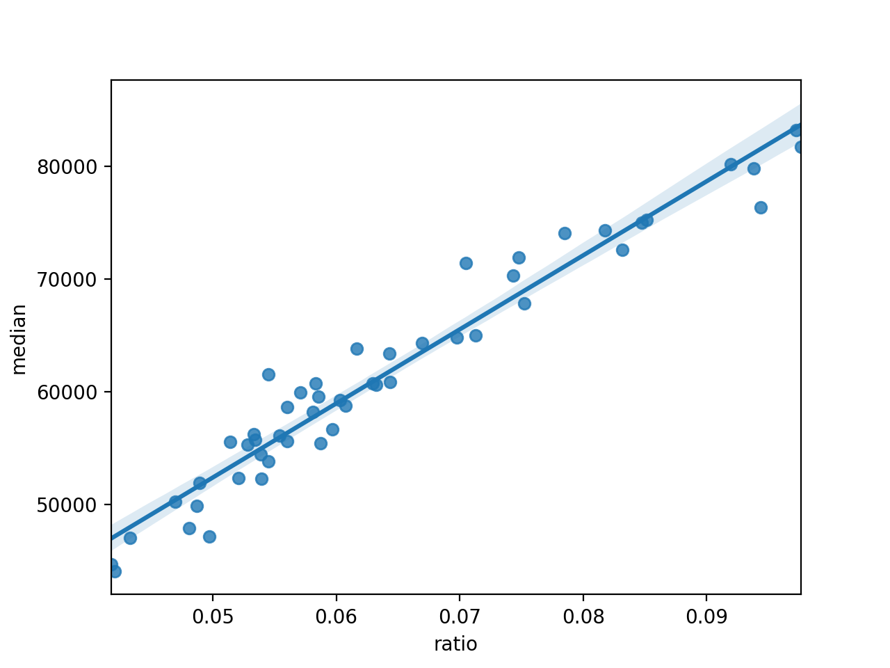

<figure>

</figure>

The number of millionaires in the US growth every year. Can you guess what is the best state to become a millionare?
### American dream 💻

 "A million dollars" is a phrase that has become synonymous with affluence and the American dream a long time ago. How is the American dream doing right now? How many millionaires are there in the US and what does it take to become one? Is it more of a "right time, right place" type of thing? Well, it might just be the ***"right state"*** type of thing.

In this blog post we explore the prevalence of the US millionaire households by US state using the data provided by [Phoenix Marketing International](https://www.phoenixmi.com/learn/report-millionaire-rankings-by-state-through-year-end-2019/). The term millionaire is often used to refer to a High Net-Worth Individual, however Phoenix Marketing International defined it as a household having more than $1,000,000 in investable assets, including everything from education accounts, IRAs, 401k, brokerages, savings accounts, and cash value life insurance policies.

Our visualisation allows to explore how the ratio of millionaire households against the approximate number of households across each of the US states, where the top 4 out of 5 states - New Jersey (9.76%), Maryland (9.72%) , Massachusetts (9.43%) and Connecticut (9.38%) belong to the East Coast, with Hawaii rounding up the top 5 with approximately 9.20% of all households being millionaire households.

### Millionares Map

    

      

      

         

          Alternative content for the legend
        

    

    

      

      

         

          Alternative content for the legend
        

    

   

You have already seen the richest states in the US, but what can we say about states with the biggest growth of millionaires? We were surprised to find out that there is literally no correlation between the ratio of millionaires and the growth of millionaires in the US. 
The biggest “winners” are Georgia, South Carolina, Arizona, Indiana, Idaho, Mississippi with growth over 10%. 
There are only two states with negative growth: Louisiana and Wyoming. They lost 1813 millionaires totally in 2019.

<canvas id="myChart" width="400" height="400"></canvas>

### Inequality and median income

> cum hoc ergo propter hoc ("with this, therefore because of this")

Can you guess the top 5 states in the US by median income? The reasonable guess would be New York, California, or Texas, right? 
I hope you will be surprised to find out that the answer is
1. New Jersey
2. Maryland
3. Connecticut
4. Massachusetts
5. Hawaii.

If this list sounds familiar to you, it is the same as the list of top five US states by millionaire ratio with a slight difference in order! There is a very strong 
correlation between the median income and ratio of millionaires. 

<figure>

</figure>

    

      

      

         

          Alternative content for the legend
        

    

   
