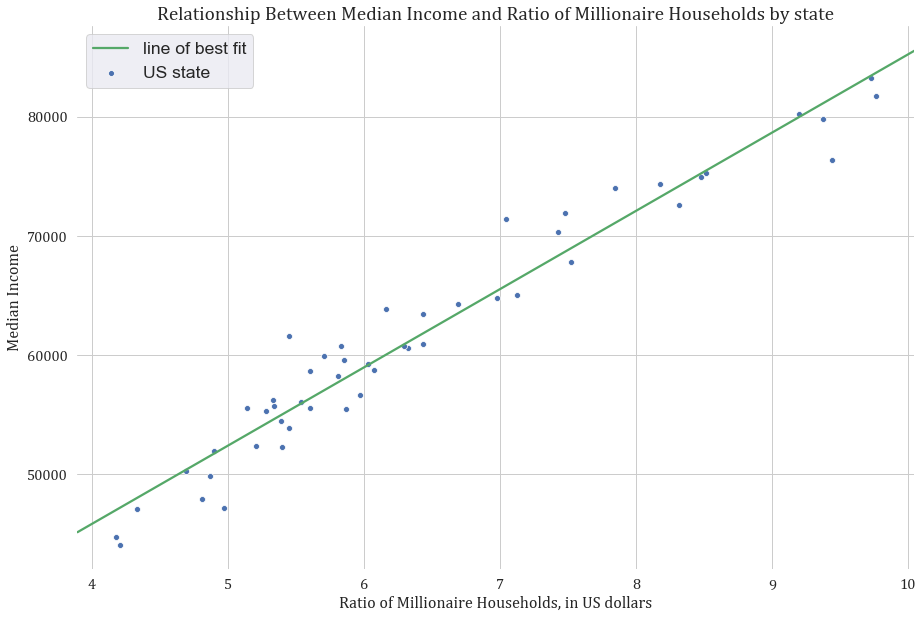

<figure>

</figure>

The number of millionaires in the US growth every year. Can you guess what is the best state to become a millionare?

### The American dream 💻

"A million dollars" is a phrase that has become synonymous with affluence and the American dream a long time ago. How is the American dream doing right now? How many millionaires are there in the US and what does it take to become one? Is it more of a "right time, right place" type of thing? Well, it might just be the **_"right state"_** type of thing.

In this blog post we explore the prevalence of the US millionaire households by US state using the data provided by [Phoenix Marketing International](https://www.phoenixmi.com/learn/report-millionaire-rankings-by-state-through-year-end-2019/). The term millionaire is often used to refer to a High Net-Worth Individual, however Phoenix Marketing International defined it as a household having more than \$1,000,000 in investable assets, including everything from education accounts, IRAs, 401k, brokerages, savings accounts, and cash value life insurance policies.

Our visualisation allows to explore how the ratio of millionaire households against the approximate number of households across each of the US states, where the top 4 out of 5 states - New Jersey (9.76%), Maryland (9.72%) , Massachusetts (9.43%) and Connecticut (9.38%) belong to the East Coast, with Hawaii rounding up the top 5 with approximately 9.20% of all households being millionaire households.

### Mapping the Millionaires

    

      

      

         

          Alternative content for the legend
        

    

What can we say about states with the biggest recent growth in the number of millionaire households? You might find it surprising there is literally no correlation between the ratio of millionaires and the year-on-year growth of millionaires in the US.

The biggest “winners”, who have seen the biggest surplus in millionaire numbers, are Georgia, South Carolina, Arizona, Indiana, Idaho, Mississippi with yearly growth over 10%. 
There are only two states with negative growth: Louisiana and Wyoming. Together, they lost 1813 millionaire households over 2019.

    

      

      

         

          Alternative content for the legend
        

    

Below

<canvas id="myChart" width="400" height="400"></canvas>

### Inequality and median income

Can you guess the top 5 states in the US by median income? The reasonable guess would be New York, California, or Texas, right? However, the surprising top 5 actually is:

1. New Jersey
2. Maryland
3. Connecticut
4. Massachusetts
5. Hawaii.

If this list sounds familiar to you, it is the same as the one on top of the article - of the top 5 US states by the ratio of millionaire households in a slightly different order! We have found that there is a very strong correlation between the median income and ratio of millionaires.

<figure>

</figure>
Looking at the graph above you might conclude that either millionaires make it sweeter for everyone or millionaires are just more common where people make more money. But in order to see whether there is any relationship between prevalence of millionaires and income inequality within the state, we would like to explore the [Gini coefficient](https://en.wikipedia.org/wiki/List_of_U.S._states_by_Gini_coefficient).

Gini coefficient is a numeric measure of inequality of incomes, which can be calculated across the state, with 0 indicating complete equality (all individuals having the same income) and 1 indicating the scenario where 1 individual making all the money, whereas everyone else makes none.

<figure>

</figure>
Not only we have not found any positive trend line between Gini coefficient and the ratio of Millionaire Households, but this relationship had a very small negative correlation. Above you can see a comparison of the two values for selected states, showing how similar Gini coefficient can be, for states with a very different ratio of millionaires.

Below you can also find an interactive map of the US states by median income. 

    

      

      

         

          Alternative content for the legend
        

    

   

